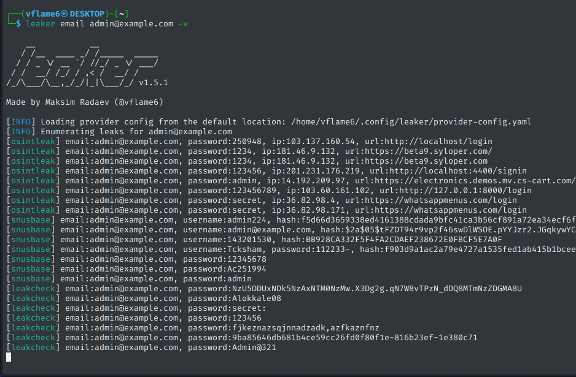

<h1 align="center">
  leaker
</h1>

<h4 align="center">Passive leak enumeration tool.</h4>

<p align="center">
<a href="https://goreportcard.com/report/github.com/vflame6/leaker" target="_blank"></a>
<a href="https://github.com/vflame6/leaker/issues"></a>
<a href="https://github.com/vflame6/leaker/releases"></a>
</p>

Created by Maksim Radaev/[@vflame6](https://github.com/vflame6)

---

`leaker` is a leak discovery tool that returns valid credential leaks for emails, using passive online sources. 


## Features



Available sources: `proxynova`, `leakcheck`

## Usage

```shell
leaker -h
```

Here is a help menu for the tool:

```yaml
Usage: leaker [<targets>] [flags]

  leaker is a leak discovery tool that returns valid credential leaks for emails, using passive online sources.

Arguments:
  [<targets>]    Target email or file with emails

Flags:
  -h, --help                                     Show context-sensitive help.
  -s, --sources=all,...                          Specific sources to use for enumeration (default all). Use --list-sources to display all available sources.
  --timeout=10s                              Seconds to wait before timing out (default 10s)
  -N, --no-rate-limit                            Disable rate limiting (DANGER)
  -o, --output=STRING                            File to write output to
  --overwrite                                Force overwrite of existing output file
  -p, --provider-config="provider-config.yml"    Provider config file
  --proxy=STRING                             HTTP proxy to use with leaker
  -A, --user-agent=STRING                        Custom user agent
  --version                                  Print version of leaker
  -q, --quiet                                    Suppress output, print results only
  -v, --verbose                                  Show sources in results output
  -D, --debug                                    Enable debug mode
  --list-sources                             List all available sources
```

## Installation

`leaker` requires **go1.25** to install successfully.

```shell
go install -v github.com/vflame6/leaker@latest
```

Compiled versions are available on [Release Binaries](https://github.com/vflame6/leaker/releases) page.

To Build:

```
go build -o leaker main.go
```

## Post-installation

`leaker` can be used right after the installation, however many sources required API keys to work. The tool will generate a provider configuration file on the first launch, you can specify API keys there.

## Contributing

Feel free to open an issue if something does not work, or if you have any issues. New ideas to improve the tool are much appreciated.
