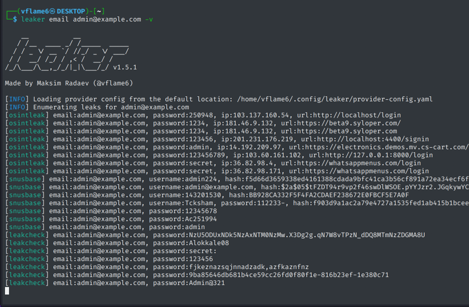

<h1 align="center">
    
    leaker
</h1>

<h4 align="center">Passive leak enumeration tool.</h4>

<p align="center">
<a href="https://goreportcard.com/report/github.com/vflame6/leaker" target="_blank"></a>
<a href="https://github.com/vflame6/leaker/issues"></a>
<a href="https://github.com/vflame6/leaker/releases"></a>
<a href="https://t.me/vflame6"></a>
</p>

<p align="center">
  <a href="#features">Features</a> •
  <a href="#installation">Install</a> •
  <a href="#configuration">Configuration</a> •
  <a href="#running-leaker">Usage</a>
</p>

Created by Maksim Radaev/[@vflame6](https://github.com/vflame6)

---

`leaker` is a leak discovery tool that returns valid credential leaks using passive online sources. It supports searching by email, username, domain, keyword, and phone number.



---

## Features

- **12 sources** — aggregates results from multiple leak databases
- **5 search types** — email, username, domain, keyword, phone
- **Deduplication** — removes duplicate results across sources
- **JSONL output** — structured output for pipelines (`-j`)
- **Rate limiting** — built-in per-source rate limits (disable with `-N`)
- **Proxy support** — route traffic through HTTP proxy (`--proxy`)
- **Multiple API keys** — load balancing across keys per source

### Available sources

| Source | API Key | Search Types | Pricing             |
|--------|---------|-------------|---------------------|
| [BreachDirectory](https://breachdirectory.org/) | Yes | all (auto-detect) | Free via RapidAPI   |
| [DeHashed](https://dehashed.com/) | Yes | email, username, domain, keyword, phone | Paid                |
| [Hudson Rock](https://hudsonrock.com/) | No* | email, username, domain | Free / Paid         |
| [Intelligence X](https://intelx.io/) | Yes | all | Free tier available |
| [LeakCheck](https://leakcheck.io/?ref=486555) | Yes | email, username, domain, keyword, phone | Paid                |
| [Leak-Lookup](https://leak-lookup.com/) | Yes | email, username, domain, keyword, phone | Paid                |
| [LeakSight](https://leaksight.com/) | Yes | email, username, domain, keyword, phone | Paid                |
| [OSINTLeak](https://osintleak.com/) | Yes | email, username, domain, keyword, phone | Paid                |
| [ProxyNova](https://www.proxynova.com/tools/comb) | No | all | Free                |
| [Snusbase](https://snusbase.com/) | Yes | email, username, domain, keyword, phone | Paid                |
| [WeLeakInfo](https://weleakinfo.io/) | Yes | email, username, domain, keyword, phone | Paid                |
| [WhiteIntel](https://whiteintel.io/) | Yes | email, username, domain | Paid                |

## Usage

```shell
leaker -h
```

This will display help for the tool. Here are all the switches it supports.

```yaml
Usage: leaker <command> [flags]

  leaker is a leak discovery tool that returns valid credential leaks for emails, using passive online sources.

Flags:
  -h, --help                                     Show context-sensitive help.
  -s, --sources=all,...                          Specific sources to use for enumeration (default all). 
                                                 Use --list-sources to display all available sources.
  --timeout=30s                                  Seconds to wait before timing out (default 30s)
  -N, --no-rate-limit                            Disable rate limiting (DANGER)
  -j, --json                                     Output results as JSONL (one JSON object per line)
  --no-deduplication                             Disable deduplication of results across sources
  --no-filter                                    Disable results filtering, include every result
  -o, --output=STRING                            File to write output to
  --overwrite                                    Force overwrite of existing output file
  -V, --verify                                   Verify credentials using HIBP password check and hash identification
  -p, --provider-config="provider-config.yml"    Provider config file
  --proxy=STRING                                 HTTP proxy to use with leaker
  -A, --user-agent=STRING                        Custom user agent
  --insecure                                     Disable TLS certificate verification (use with caution)
  --version                                      Print version of leaker
  -q, --quiet                                    Suppress output, print results only
  -v, --verbose                                  Show sources in results output
  -D, --debug                                    Enable debug mode
  -L, --list-sources                             List all available sources

Commands:
  domain      Search by domain name.
  email       Search by email address.
  keyword     Search by keyword.
  phone       Search by phone number.
  username    Search by username.

  Run "leaker <command> --help" for more information on a command.
```

Learn more about Leaker's options here: https://github.com/vflame6/leaker/wiki/Usage

## Installation

`leaker` requires **go1.24** to install successfully. Run the following command to install the latest version:

```shell
go install -v github.com/vflame6/leaker@latest
```

Learn about more ways to install leaker here: https://github.com/vflame6/leaker/wiki/Install

### Configuration

`leaker` can be used right after the installation, however many sources require API keys to work. Learn more here: https://github.com/vflame6/leaker/wiki/Configuration

### Running Leaker

Learn about how to run Leaker here: https://github.com/vflame6/leaker/wiki/Running

## Contributing

Feel free to open an issue if something does not work, or if you have any ideas to improve the tool.
